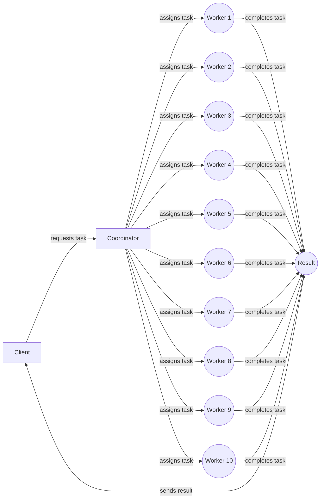

  <h1>Proletarian Distributed Computing (PDC)</h1>
  <h2>Overview</h2>
  
Proletarian Distributed Computing (PDC) is a distributed computing framework built with Rust that allows users to easily distribute computing tasks across multiple machines. The framework consists of a set of worker nodes and a central coordinator node that manages the distribution of tasks.

  
  <h2>Architecture</h2>
  
The PDC architecture consists of the following components:

  <ul>
    <li>Worker Nodes: These are the machines that perform the actual computing tasks. Worker nodes run the PDC worker process and communicate with the central coordinator to receive tasks and report results.</li>
    <li>Central Coordinator Node: This is the machine that manages the distribution of tasks to the worker nodes. The coordinator runs the PDC coordinator process and maintains a queue of tasks to be executed. When a worker node becomes available, the coordinator assigns the next task in the queue to the worker.</li>
    <li>Task Queue: The task queue is a list of tasks to be executed by the worker nodes. The queue is managed by the central coordinator, and tasks are added to the queue as they are received from the client.</li>
    <li>Client: The client is the entity that submits tasks to be executed by the worker nodes. The client communicates with the central coordinator to submit tasks and receive results.</li>
  </ul>
  <h2>Workflow</h2>

  <h1>Proletarian Distributed Computing (PDC)</h1>
  <h2>Overview</h2>
  
Proletarian Distributed Computing (PDC) is a distributed computing framework for Rust that allows users to easily distribute computing tasks across multiple machines. The framework consists of a set of worker nodes and a central coordinator node that manages the distribution of tasks.

  <h2>Architecture</h2>
  
The PDC architecture consists of the following components:

  <ul>
    <li>Worker Nodes: These are the machines that perform the actual computing tasks. Worker nodes run the PDC worker process and communicate with the central coordinator to receive tasks and report results.</li>
    <li>Central Coordinator Node: This is the machine that manages the distribution of tasks to the worker nodes. The coordinator runs the PDC coordinator process and maintains a queue of tasks to be executed. When a worker node becomes available, the coordinator assigns the next task in the queue to the worker.</li>
    <li>Task Queue: The task queue is a list of tasks to be executed by the worker nodes. The queue is managed by the central coordinator, and tasks are added to the queue as they are received from the client.</li>
    <li>Client: The client is the entity that submits tasks to be executed by the worker nodes. The client communicates with the central coordinator to submit tasks and receive results.</li>
  </ul>
  <h2>Workflow</h2>

  </ol>
  <h2>Benefits</h2>
  <ul>
    <li>Scalability: PDC allows for the distribution of computing tasks across multiple machines, which can greatly increase the speed of computation for large-scale problems.</li>
    <li>Fault tolerance: PDC is fault-tolerant, meaning that if a worker node fails or becomes unresponsive, the coordinator can reassign the task to another worker node.</li>
    <li>Easy to use: PDC is designed to be easy to use and does not require users to have advanced knowledge of distributed computing or networking.</li>
  </ul>

